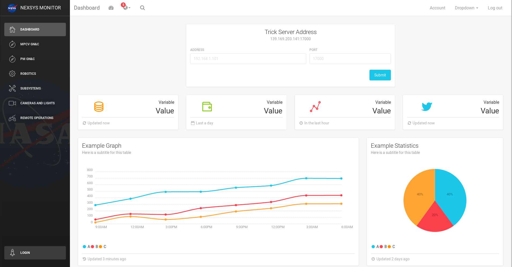

# Simulation Monitor



**Simulation Monitor** is a web-based monitoring tool to be used for any NExSyS simulation. For background on the project see [here](https://drive.google.com/open?id=13PfHKjtYUtsJQI2PvytLx_p_4slD7lnW) (NOTE that the screenshots in the presentation are out of date but the information is correct). The application uses Golang for its back-end and React for its front-end. The only tools that you will need to get it running are Trick (of course), Golang, Nodejs, npm, and the repositories for the NExSyS simulations (which is where you should viewing this).


## Terminal Commands

1. Install NodeJs from [NodeJs Official Page](https://nodejs.org/en) which should come bundled with npm if you do not have it already.
2. Install Go from [Golang Official Page](https://golang.org/doc/install).
3. Open Terminal
4. Go to your Go workspace directory
5. Clone the repository. Filepath should be: ```~/{Your Go Workspace}/src/```
6. cd into the nexsysSimMonitor project directory
7. Run in terminal: ```npm install``` to install all dependencies.
8. You can now either run ```go run server.go address:port``` then ```npm start``` so that you can view live changes quickly in-browser or you can cd into /src and run ```npm run build``` to create an optimized version of the project. To view the optimized version run ```go run server.go address:port``` and navigate to the specific address and port that you provided in a web browser.
9. **NOTE** that you must change the socket variable on line 585 of ```~/{Your Go Workspace}/src/nexsysSimMonitor/src/variables/Variables.jsx``` to reflect the address and port that you specified for the server.

### Project Directory Structure
```
nexsysSimMonitor
├── README.md
├── package.json
├── server.go
├── Parsers
│   ├── parseTrickSie.go
│   └── TrickVarParse.go
├── public
│   ├── apple-icon.png
│   ├── favicon.ico
│   ├── index.html
│   └── manifest.json
└── src
    ├── index.js
    ├── assets
    │   ├── css
    │   ├── fonts
    │   ├── img
    │   │   └── faces
    │   └── sass
    │       ├── lbd
    │       │   └── mixins
    │       ├── light-bootstrap-dashboard.css
    │       └── light-bootstrap-dashboard.scss
    ├── components
    │   ├── Card
    │   │   └── Card.jsx
    │   ├── CustomButton
    │   │   └── CustomButton.jsx
    │   ├── CustomCheckbox
    │   │   └── CustomCheckbox.jsx
    │   ├── CustomRadio
    │   │   └── CustomRadio.jsx
    │   ├── Footer
    │   │   └── Footer.jsx
    │   ├── FormInputs
    │   │   └── FormInputs.jsx
    │   ├── Header
    │   │   ├── Header.jsx
    │   │   └── HeaderLinks.jsx
    │   ├── Sidebar
    │   │   └── Sidebar.jsx
    │   ├── StatsCard
    │   │   └── StatsCard.jsx
    │   ├── Tasks
    │   │   └── Tasks.jsx
    │   └── UserCard
    │       └── UserCard.jsx
    ├── layouts
    │   └── Dashboard
    │       └── Dashboard.jsx
    ├── routes
    │   ├── dashboard.jsx
    │   └── index.jsx
    ├── variables
    │   ├── S_sie.resource
    │   ├── Sockets.jsx
    │   ├── Variables.jsx
    │   └── trick
    │       ├── vars_displayed.xml
    │       └── displays
    └── views
        ├── CamsLights
        │   └── CamsLights.jsx
        ├── Dashboard
        │   └── Dashboard.jsx
        ├── MPCV
        │   └── MPCV.jsx
        ├── PM
        │   └── PM.jsx
        ├── RemoteOperations
        │   └── RemoteOperations.jsx
        ├── Robotics
        │   └── Robotics.jsx
        ├── SubSys
        │   └── SubSys.jsx
        └── User
            └── User.jsx
```
## Golang (Back-end) Links:
- Homepage: <https://golang.org/>
- Tutorial: <https://tour.golang.org/list>
- Benefits of Go: <https://medium.com/exploring-code/why-should-you-learn-go-f607681fad65>
- Golang wiki: <https://github.com/golang/go/wiki>
- Concurrency links: <https://tour.golang.org/concurrency/11>
- Best Golang reference: <https://gobyexample.com/>

## React (Front-end) Links:
- Homepage: <https://reactjs.org/>
- Getting Started: <https://reactjs.org/docs/getting-started.html>
- React-Bootstrap Documentation: <https://react-bootstrap.github.io/>
- Popularity: <https://medium.freecodecamp.org/yes-react-is-taking-over-front-end-development-the-question-is-why-40837af8ab76>
- Example Project: <https://medium.freecodecamp.org/how-to-build-a-react-js-chat-app-in-10-minutes-c9233794642b>
- Quick Introduction: <https://medium.freecodecamp.org/learn-react-js-in-5-minutes-526472d292f4>

## Contacts:
- Daniel Delago: ddelago0596@gmail.com, daniel.b.delago@nasa.gov
- Paul Bielski: paul.bielski@nasa.gov
